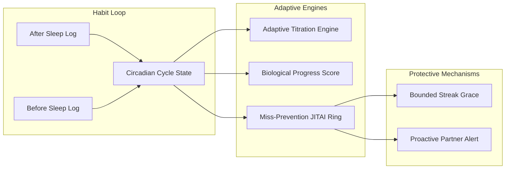
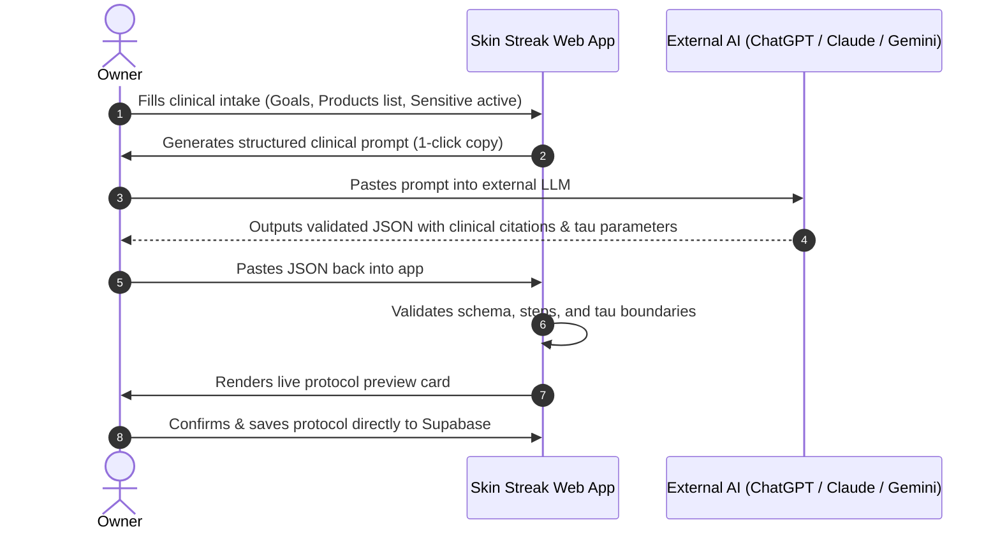

# Skin Streak ✨ (v3)

> A private, shared skincare habit tracker tailored for irregular sleep schedules, featuring real authenticated roles (**Owner** and **Partner**), event-driven sleep-cycle logging, a biologically grounded Progress Score algorithm, an adaptive active titration engine, research-backed miss-prevention, and zero-runtime AI clinical protocol calibration.

[](https://vitejs.dev/)
[](https://supabase.com/)
[](#authentication--security)
[](#design-philosophy)
[](#automated-testing--verification)
[](LICENSE)

---

## Why Skin Streak v3?

Traditional habit trackers make two fatal assumptions:
1. **Clock-time rigidity**: Assuming a fixed 24-hour day where "morning" is 8 AM and "night" is 10 PM. For shift workers, creative freelancers, or anyone with an irregular circadian rhythm, calendar-day resets create false misses or quietly disrupt progressive retinoid build-up schedules.
2. **Unguessable links without access control**: Sharing a raw open URL means anyone with the link can edit the log, and there is no private, secure way to store your accountability partner's contact info.

**Skin Streak solves both with a clinically sound, role-authenticated architecture**:
- **Event-Driven Check-Ins**: Logged as **"After Sleep"** and **"Before Sleep"** whenever life happens, never inferred from clock time.
- **Two Real Authenticated Roles**:
  - **Owner**: Logs check-ins, customizes routines, manages partner invites, configures private notification settings.
  - **Partner**: Read-only real-time accountability view. Cannot mutate logs. Stored partner contact details are strictly hidden at the PostgreSQL database level.
- **Adaptive Titration Protocol**: Self-paces based on actual logged active treatments (e.g. Adapalene, Tretinoin, Exfoliating Acids), never calendar days. A forgotten night can never be silently counted as a scheduled rest night.
- **One-Tap Logging & WhatsApp Alerts**: Tapping a routine records the timestamp, updates the streak, and opens a pre-filled WhatsApp message to your partner in one gesture.

---

## Core Algorithms & Scientific Engineering

Beyond standard habit tracking, Skin Streak runs a suite of computational engines grounded in dermatological pharmacodynamics and behavioral psychology:



### 1. Biological Progress Score (Dual Asymptotic Kinetics)
Unlike punitive streak counters that reset to zero on an accidental miss, the **Progress Score** ($0–100$) models real-world epidermal cellular turnover, stratum corneum desquamation, and active receptor saturation:
- **Zero Database State**: Computed fresh on every render directly from chronological cycle history; never stored as a volatile running total.
- **Asymptotic Compliance Growth**:
  $$\Delta P = g \cdot (100 - P), \quad g = 1 - e^{-1/\tau_{\text{gain}}}$$
  Default $\tau_{\text{gain}} = 60\text{ days}$ ($g \approx 0.01653$). Early adherence yields rapid initial gains; approaching steady-state requires prolonged consistency. Complete cycles earn full gain ($+g(100 - P)$); partial/orphaned cycles earn half ($+0.5g(100 - P)$).
- **Exponential Biological Decay**:
  $$P(t) = P_0 \cdot e^{-\Delta t / \tau_{\text{decay}}}$$
  Default $\tau_{\text{decay}} = 58\text{ days}$. Models microcomedone reformation and desquamation slowdown during missed intervals.
- **Parameterizable Time Constants**: Fully configurable per tracker ($\tau_{\text{gain}}, \tau_{\text{decay}}$) based on clinical turnover timelines for specific active ingredients (Grove & Kligman 1983; Leyden et al.).
- **Clinical Phase Bands**: Maps scores to biological milestones:
  - `0–39`: *Receptor Upregulation*
  - `40–74`: *Keratinization Normalization*
  - `75–94`: *Therapeutic Clarity Peak*
  - `95–100`: *Epidermal Equilibrium*

---

### 2. Adaptive Titration Engine & Lazy-Skip Protection
Progressive treatments (retinoids, direct acids) require gradual acclimation to build barrier tolerance while avoiding retinoid dermatitis:
- **Behavior-Derived Alternation**: Evaluates the most recent logged before-sleep cycle rather than elapsed clock time.
- **Phase 1 (Acclimation / Build-Up)**: Strictly alternates treatment and intentional rest nights. If the last logged application was active, tonight is **REST**. If the last was rest, tonight is **ACTIVE**.
- **Lazy-Skip Protection**: Missed or unlogged cycles in between simply do not exist in this lookup—skipping a night can never be used to justify skipping the next scheduled active application.
- **Phase Transitions**: Automatically transitions across configurable count milestones (e.g. `[7, 21]` active nights) into nightly application and maintenance phases.
- **Safe State Reconciliation**: Non-titration routines (`has_titration_schedule: false`) automatically bypass alternation and render consistent nightly guidance without breaking history.

---

### 3. Research-Backed Miss-Prevention Suite
Engineered to intercept lapses before they occur, backed by behavioral science:
- **Implementation Intentions (Gollwitzer 1999)**: Anchors routines to personal situational cues (*"right when my alarm rings"*, *"while morning coffee brews"*) rather than abstract clock times, proven to boost follow-through 2–3x for irregular schedules.
- **Personal Risk Ring (JITAI / Nahum-Shani 2018)**: Just-in-Time Adaptive Intervention engine that continuously computes the user's rolling median waking and sleeping gaps. A dynamic SVG ring shifts through 3 buffer zones:
  - **Healthy Buffer (Green)**: $< 70\%$ of typical personal gap elapsed.
  - **Approaching Window (Amber)**: $70\%–99\%$ elapsed.
  - **Past Typical Window (Red)**: $\ge 100\%$ elapsed, loss-framed against the current streak and score.
- **Bounded Streak Grace (Herman & Polivy 1975, 2010 Restraint Theory)**: Prevents the destructive *"What-the-Hell Effect"* (where a single lapse triggers complete habit abandonment). Allows at most **1 shielded miss per rolling 30 real days** on the motivational streak counter, while the biological Progress Score remains strictly unshielded and decays honestly.
- **Proactive Partner Escalation**: Detects overdue routines past the personalized gap (+2h safety buffer) with database deduplication (`partner_alerted_cycle_id`) to prevent spamming.

---

### 4. Zero-Runtime AI Protocol Calibration
Skin Streak features an AI-assisted dermatologist calibration workflow requiring **zero API keys, zero external API costs, and zero runtime latency**:



- **Clinical Prompt Generator**: Analyzes products for ingredient contraindications (e.g. retinoids mixed with direct AHAs/BHAs), defines active/rest steps, and calculates epidermal turnover $\tau$ constants grounded in dermatology literature.
- **Schema Validator**: Cleans markdown code fences, clamps $\tau$ parameters (14–180 days), checks phase thresholds, and validates routine arrays.
- **Direct Persistence**: Saves `routine_config`, `has_titration_schedule`, `titration_phase_thresholds`, $\tau$ values, and `sources_summary` directly to the tracker row in Supabase.

---

## Feature Tour

| Feature | Description | Target Role |
| :--- | :--- | :--- |
| **Circadian Check-Ins** | Large 48px+ tactile buttons for After Sleep and Before Sleep check-ins | Owner |
| **WhatsApp Accountability** | 1-tap logging opens pre-filled compose window (`wa.me`) with timestamp and streak | Owner → Partner |
| **Generic Routine Builder** | Interactive modal to configure custom ordered steps, custom titration actives, and phase thresholds | Owner |
| **Timeline Strip** | 60-cycle interactive visual history showing completion, rest, misses, and grace shields | Both |
| **Partner "Did You Forget?" Nudge** | Partner can send real push notifications to Owner's phone with 1-hour atomic cooldown | Partner → Owner |
| **PWA & Native Web Push** | Installable on Android home screen (`display: standalone`) with FCM push notifications | Both |
| **Privacy Matrix** | Partner's phone number strictly masked to `NULL` via `trackers_view` | Database Level |

---

## Authentication & Security

```text
               ┌───────────────────────────────┐
               │  Supabase Auth (Magic Links)  │
               └──────────────┬────────────────┘
                              │
             ┌────────────────┴────────────────┐
             ▼                                 ▼
   ┌───────────────────┐             ┌───────────────────┐
   │    Owner Role     │             │   Partner Role    │
   │ Full Read & Write │             │  Read-Only Access │
   │ Controls Routine  │             │   Phone Hidden    │
   └─────────┬─────────┘             └─────────┬─────────┘
             │                                 │
             ▼                                 ▼
   ┌─────────────────────────────────────────────────────┐
   │         PostgreSQL Row Level Security (RLS)         │
   │  - cycles: SELECT (all), INSERT/UPDATE/DELETE (owner)│
   │  - trackers: partner_phone masked via trackers_view │
   │  - partner_invites: owner-only                      │
   │  - redeem_partner_invite(): SECURITY DEFINER RPC    │
   │  - record_partner_nudge(): atomic cooldown RPC      │
   └─────────────────────────────────────────────────────┘
```

1. **Passwordless Magic Links**: Both Owner and Partner authenticate via Supabase email magic links. No passwords to leak or hash.
2. **Zero Service-Role Key Exposure in Client**: All invite redemptions and partner nudges occur via PostgreSQL `SECURITY DEFINER` stored procedures.
3. **Database-Enforced Privacy**: The Partner's phone number is masked to `NULL` for non-owners via PostgreSQL security definitions. Even raw API queries cannot expose stored contact info.
4. **Row Level Security (RLS)**: Enforced directly on all tables so any unauthorized write attempts by a Partner session are rejected by Postgres.

---

## Design Philosophy

The interface is designed to feel tactile, editorial, and calm—reminiscent of high-end apothecary packaging:

| Token | Hex | Role |
| :--- | :--- | :--- |
| **Background** | `#F6EFE6` | Warm parchment canvas |
| **Panel / Surface** | `#FFFDF8` | Tactile card surfaces |
| **Ink** | `#2A2420` | High-contrast editorial typography |
| **After Sleep** | `#E2A64B` | Warm radiant gold |
| **Before Sleep** | `#2B2E6B` | Deep circadian indigo |
| **Intentional Rest** | `#5B7D62` | Sage green (barrier recovery success) |
| **Missed** | `#B45341` | Brick red (unfilled cycle half) |
| **Grace Shielded** | `#E2A64B` | Shielded miss boundary |

**Typography**:
- **Fraunces** (Serif) — Expressive display typeface for streak counters, headers, and milestones.
- **Sora** (Sans-Serif) — Modern geometric sans for buttons, metrics, and routine guides.

---

## Automated Testing & Verification

Skin Streak maintains strict algorithmic correctness with **12 automated test suites** and a dedicated numerical equivalence verification harness:

```bash
# Run all 12 test suites
npm test

# Run strict numerical equivalence verification against historical cycle logs
node scripts/verify-parameterization.js
```

### Test Coverage:
- **Suite 1**: Cycle-filling mechanics and open-cycle resolution.
- **Suite 2**: Adaptive titration schedule, self-pacing, and lazy-skip protection.
- **Suite 3**: Consecutive cycle streak and missed cycle accounting.
- **Suite 4**: Adaptive nudge banner thresholds.
- **Suite 5**: 60-cycle timeline strip markers and state mapping.
- **Suite 6**: WhatsApp message formatting.
- **Suite 7**: Before-sleep guide card state reconciliation.
- **Suite 8**: Progress Score dual-asymptotic kinetics and milestone boundaries.
- **Suite 9**: Miss-prevention engine (Implementation Intentions, JITAI Risk Ring, Bounded Grace, Proactive Alerting).
- **Suite 10**: Partner-initiated push nudge and cooldown engine.
- **Suite 11**: Parameterized routines, generic non-titration modes, and custom $\tau$ scaling.
- **Suite 12**: AI calibration prompt generator, schema validation, and error recovery.

---

## Setup & Deployment

### 1. Database Setup (Supabase)
1. In your [Supabase Dashboard](https://supabase.com/dashboard), open the **SQL Editor**.
2. Run [`supabase_schema.sql`](./supabase_schema.sql) to create:
   - Tables: `trackers`, `cycles`, `partner_invites`, `tracker_partners`, `push_subscriptions`.
   - RLS policies and `trackers_view`.
   - `redeem_partner_invite` and `record_partner_nudge` stored procedures.
   - Realtime publication replication.

### 2. Environment Variables
Create a `.env` file (or set in Vercel):
```bash
VITE_SUPABASE_URL=https://your-project.supabase.co
VITE_SUPABASE_ANON_KEY=your-anon-key
```

### 3. Local Development
```bash
# Install dependencies
npm install

# Run automated test suites
npm test

# Verify parameterization equivalence
node scripts/verify-parameterization.js

# Start local dev server
npm run dev
```

### 4. Deploying to Vercel
1. Push repository to GitHub.
2. Import project in [Vercel](https://vercel.com/new).
3. Set Framework Preset to **Vite**.
4. Configure environment variables (`VITE_SUPABASE_URL`, `VITE_SUPABASE_ANON_KEY`).
5. Deploy.

---

## Project Structure

```text
skincare/
├── index.html                  # Entry point with PWA metadata & Google Fonts
├── supabase_schema.sql         # Postgres schema, RLS policies, trackers_view & RPCs
├── vercel.json                 # SPA routing rewrite & API endpoint passthrough
├── vite.config.js              # Vite build configuration
├── api/
│   ├── send-push.js            # Serverless FCM / Web Push dispatcher
│   └── send-partner-nudge.js   # Partner nudge handler with atomic cooldown enforcement
├── public/
│   ├── manifest.json           # PWA standalone manifest with theme tokens
│   ├── sw.js                   # Service worker: precache, push handler & notificationclick
│   └── icons/                  # Adaptive icons (192, 512, badge-96)
├── src/
│   ├── main.js                 # App controller, routine builder, AI calibration & views
│   ├── cycles.js               # Progress Score, JITAI Risk Ring, Titration & Grace algorithms
│   ├── calibration.js          # AI prompt generator & clinical JSON schema validator
│   ├── push.js                 # PushManager registration & FCM token acquisition
│   ├── auth.js                 # Supabase Auth magic-link & invite token redemption
│   ├── storage.js              # Role discovery, cycles CRUD, push sync & Realtime subscriptions
│   └── style.css               # Design tokens, Fraunces/Sora styling, Risk Ring & modals
├── test/
│   └── cycles.test.js          # 12 comprehensive automated test suites
└── scripts/
    ├── check-reminders.js      # Hourly scheduled reminder job (Web Push + WhatsApp)
    └── verify-parameterization.js # Numerical equivalence verification harness
```

---

## License

MIT © [uncoolburrito](https://github.com/uncoolburrito)
